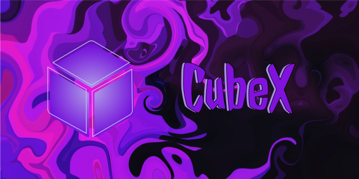
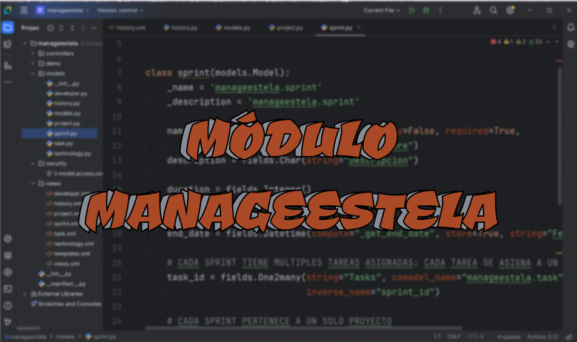
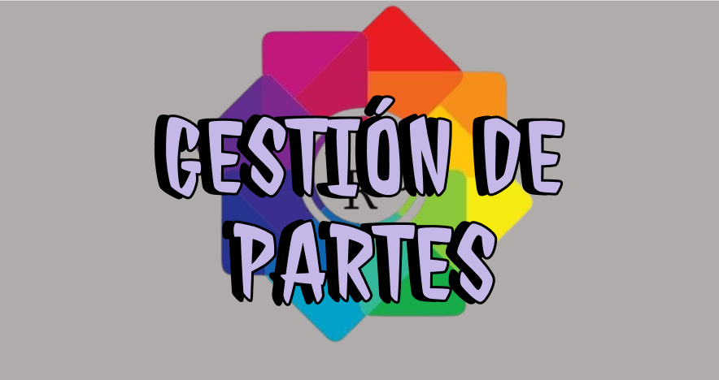

  <h1 align="center">Hi, I'm Estela! 👋</h1>

## About me
- 💻 Student of Cross-platform Application Development.
- 🤝 Open to all kinds of advice! Always grateful for the help of the GitHub community.
- 👩‍💻 &lt;coding in&gt; progress.

## Languages and tools 

    
    
      
    
    
    
    
    
    
    
    
    
    
    
    
    
    
    
    

## *Current* projects
<table>
  <tr>
    <th width="25%">
      <h3 align="center">CubeX TFG</h3>
    </th>
    <th width="25%">
      <h3 align="center">Odoo Manageestela Module</h3>
    </th>
    <th width="25%">
      <h3 align="center">Reports Management</h3>
    </th>
    <th width="25%">
      <h3 align="center">House of Ghosts</h3>
    </th>
  </tr>
  <tr>
    <td width="25%">
      

        
        
Starting a part of the <a href="https://github.com/estelaV9/TFG_CubeX">TFG</a> in the Interface Development module of <b>CubeX</b>.   
          An aplication that, for now, will be a timer for the resolutions of the diferents Rubik's cubes and will have a history and statistics.
            <ul>
                <li>
                    <a href="https://github.com/estelaV9/DesarrolloInterfaces/blob/master/ProyectoFlutter_ParteTFG/EnunciadoPractica.md">Objetive</a> of the project.
                </li>
                <li>
                    <a href="https://github.com/estelaV9/DesarrolloInterfaces/blob/master/ProyectoFlutter_ParteTFG/EstelaDeVega_WireframeCubeX.pdf">Scheme</a> (mockup or wireframe) of how the application will be designed and a description of it.                       
                </li>
              <li>
                Application <a href="https://github.com/estelaV9/DesarrolloInterfaces/blob/master/ProyectoFlutter_ParteTFG/EstelaDeVega_ModeloInicialCubeX.pdf">Initial model</a>.  
                Includes use cases, display component diagrams, UML and the <a href="https://github.com/estelaV9/DesarrolloInterfaces/blob/master/ProyectoFlutter_ParteTFG/databaseCubeX.db">database</a>.
              </li>
            </ul>
         
      
 
    </td>
    <td width="25%">
      

        
        
Working in a <a href="https://github.com/estelaV9/SistemasGestionEmpresarial/blob/master/Proyecto_ModuloManage/deVega_Martin_Estela_proyectomanage.pdf">memory</a> module development <a href="https://github.com/estelaV9/SistemasGestionEmpresarial/tree/master/Proyecto_ModuloManage/manageestela">Manageestela</a> for Odoo, detailing:
          <ul>
            <li>The fundamentals of ERP and SCRUM.</li>
            <li>The architecture and design of the module.</li>
            <li>Your extension.</li>
            <li>The tools used.</li>
            <li>The tests performed.</li>
          </ul>

      

    </td>
    <td width="25%">
      

        
        
Working in a final <a href="https://github.com/HugoReyHol/gestion-faltas">project</a> in Hibernate as a group implementing a system with two types of users
          <ul>
            <li>Teachers</li>
            <li>Heads of Studies.</li>
          </ul>
          Each one with specific menus to manage reports, students and teachers.  
          <a href="https://github.com/estelaV9/AccesoADatos/blob/master/ProyectoFinalHibernate/Enunciado_ProyectoFinalHibernate.pdf">Objective</a> of the practice.    
      

      
 
    </td>
    <td width="25%">
      

        
        
Developing a <a href="https://github.com/estelaV9/ProyectoCasaFantasmas">application</a> from <b>"The House of Ghosts"</b>, where you will have to navigate the mansion solving puzzles in each room to move until you reach the final room with the sweets.

      

    </td>
 </tr>  
</table>  

## Current *previous* project
<table>
  <tr>
    <th width="50%">
      <h3 align="center">$BankPal Application</h3>
    </th>
    <th width="50%">
      <h3 align="center">CubeX Galaxy Shopping App</h3>
    </th>
  </tr>
  <tr>
    <td width="50%">
      

        
        
PMDM review practice to manage clients' bank accounts.  
            Note: The task is perfect   
            The project idea has been expanded in the module <b>Interface Development</b> in Figma,
            developing a more complete bank <a href="https://www.figma.com/design/PizvLATau8znIQ6XHmyI3y/Untitled?node-id=0-1&t=88QiglBwpE1F3hZd-1">application</a> and with more functionalities.  
            Note: 10.

      
 
    </td>
    <td width="50%">
      

        
        
Exercise AAD form for purchasing Rubik's cube with your <a href="https://github.com/estelaV9/AccesoADatos/blob/master/Tema1_AccesoBDRelacionales/EjercicioFormularioFX/PracticaFormulario.md">user manual</a> of practice.   
          STATUS: FINISHED   
          This same idea is being realized in the module <b>Business Management Systems</b> but in the programming language <b>Python</b>. 
          You can check out the exercise in the <a href="https://github.com/estelaV9/SistemasGestionEmpresarial/tree/master/Tema3_Python/Python_SGE/12proyecto_cubex">Practice 12</a>.  
          Note: 9.20.

      
 
    </td>
 </tr>                                                           
</table>  
&nbsp;

## Modules currently *studying*
<table>
  <tr>
    <th width="33%">
      <h3 align="center">Data Access</h3>
    </th>
    <th width="33%">
      <h3 align="center">PMDM</h3>
    </th>
    <th width="33%">
      <h3 align="center">Business Management Systems</h3>
    </th>
  </tr>
  <tr>
    <td width="33%">
      

        
        
Exercises of the Data Access module.  
                  
        

      
 
    </td>
    <td width="33%">
      

        
        
Exercises of the PMDM module.  
          
        

      
 
    </td>
    <td width="33%">
      

          
        
Exercises of the SGE module

      
 
    </td>
  </tr>
  <tr>
    <th width="33%">
      <h3 align="center">Interface Development</h3>
    </th>
    <th width="33%">
      <h3 align="center">Programming of Services and Processes</h3>
    </th>
    <th width="33%">
      <h3 align="center">Enterprise and Entrepreneurial Initiative</h3>
    </th>
  </tr>
  <tr>
    <td width="33%">
      

          
         
        
Exercises of the Interface Development module.

      
 
    </td>
    <td width="33%">
      

        
        
Exercises of the Programming of Services and Processes module.

      
 
    </td>
    <td width="33%">
      

        
        
Exercises of Enterprise and Entrepreneurial Initiative module.

      
 
    </td>
  </tr>
</table>  
&nbsp;

## Project *tops*
<table>
  <tr>
    <th width="50%">
      <h3 align="center">Shruk's Museum</h3>
    </th>
    <th width="50%">
      <h3 align="center">CubeX</h3>
    </th>
  </tr>
  <tr>
    <td>
      

        
        
A peculiar museum about Shruk, a dark alter ego of Shrek. Explore a unique collection of images related to this quirky character. 🐸 Note of programming: 7.80   Note development environments: 10.   Final note: 8.45

      

    </td>
    <td 
      

        
        
Finished a Rubik's cube application, where you can time your times, participate in competitions, chack your statistics and compete in one versus one matches.
          Referring to the project from <a href="https://github.com/estelaV9/CubexDatabase">database</a>.  Final note: 9.5  
                  
        

      
 
    </td>
  </tr>                                                           
</table>  
&nbsp;

## ⚙️ Github Statistics

  <a href="https://github.com/estelaV9">
    
    
    <!--   -->
    
  </a>

