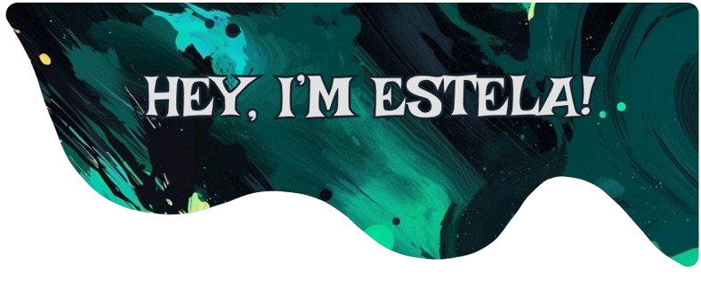

|  |
|:----------------------------------------------------------------------:|

## About me
- 💻 Advanced Technical in Cross-platform Application Development.
- 🏅 Honors Mention in the Final Degree Project ([CubeX](https://github.com/estelaV9/TFG_CubeX)).
- 🤝 Open to all kinds of advice! Always grateful for the help of the GitHub community.
- 👩‍💻 &lt;coding in&gt; progress.

## Languages and tools 

    <code></code>
    <code></code>
    <code></code>
    <code></code>
    <code></code>
    <code></code>
    <code></code>
    <code></code>
    <code></code>
    <code></code>
    <code></code>
    <code></code>
    <code></code>
    <code></code>
    <code></code>
    <code></code>
    <code></code>
    <code></code>
    <code></code>

 
  
<h2>📜 Licenses and certifications</h2>

  <table>
    <tr>
      <th align="center">
        <h3 align="center">Introduction to Spring Data JPA</h3>
      </th>
      <td width="25%">
        <h3 align="center">HHSS + Introduction to Java</h3>
      </td>
      <td width="25%">
        <h3 align="center">Java</h3>
      </td>
    </tr>
    <tr>
      <td align="left" width="40%">
        
        

          Completed a course on <b>Introduction to Spring Data JPA</b> in OpenWeBinars.  
          <a href="https://github.com/estelaV9/AccesoADatos/blob/master/Curso_IntroduccionSpringDataJPA/certificado_introducci%C3%B3n_a_spring_data_jpa.pdf">View certificate</a>
        

      </td>
      <td colspan="2" width="60%">
        

          During the internship period of the DAM degree, I received an intensive 1-month training divided into two parts:
        <ul>
          <li><strong>Soft skills:</strong> employability, communication, teamwork, CV creation and job interviews.</li>
          <li><strong>Java (JSE + JEE):</strong> fundamentals, OOP, inheritance, Spring MVC, Hibernate, unit testing, and REST APIs with Spring Boot.</li>
        </ul>
        We concluded with a <strong>practical project using Spring MVC</strong> to apply the knowledge acquired.
        

      </td>
    </tr>
  </table>

 
  
<h2>📘 Current Projects</h2>

  <h3>CubeX: Cross-platform app for speedcubing</h3>
  
        
CubeX is a cross-platform application initially developed as a Final Degree Project (TFG), focused on the world of <i>speedcubing</i> — the practice of solving Rubik’s cubes or other twisty puzzles in the shortest time possible. Designed to meet the needs of both beginners and advanced users, CubeX offers a complete, intuitive, and accessible experience that goes far beyond a simple timer.

<h4>🛠 Technologies Used</h4>
<ul>
  <li>
    <h5> Flutter +  Dart</h5>
    

      Built with a single codebase for both Android and Windows, providing a unified, internationalized experience. Support for macOS, iOS, and Linux is coming soon.
    

  </li>
  <li>
    <h5> Supabase</h5>
    

      Backend as a Service offering:
      <ul>
        <li>Secure user authentication.</li>
        <li>Real-time database (PostgreSQL).</li>
        <li>Cloud storage for data and images.</li>
      </ul>
    

  </li>
  <li>
    
    <h5> Figma</h5>
    

      Used for UI/UX design and prototyping, resulting in an attractive, accessible, and user-friendly interface. The app also features its own mascot, Cubix, who guides users through the app, especially during their first use.
    

  </li>
</ul>

 

<h4>Features</h4>
Key features include:
<ul>
  <li>A powerful <b>timer</b> with advanced configuration options and full customization for sounds, pre-inspection, and languages.</li>
  <li>A <b>scramble generator</b> adapted to multiple cube types (2x2, 3x3, Square-1, Megaminx, Pyraminx, and more).</li>
  <li>A detailed <b>statistics system</b> that shows best times, averages (Ao5, Ao12, Ao100), penalty percentages, and performance graphs by session.</li>
  <li><b>PDF export</b> of session times, useful for tracking progress or keeping physical/digital logs.</li>
  <li>Integration of <b>notifications and reminders</b> to support consistent training habits.</li>
</ul>

 

<h4>Additional Highlights</h4>

🏅 CubeX was recognized as the best project of the year, receiving the <b>Honors Mention</b>. As part of the presentation, the project was enhanced with:

<ul>
  <li>Informative brochures for attendees.</li>
  <li>Stickers featuring the app’s mascot, Cubix.</li>
  <li>A custom-designed t-shirt featuring Cubix.</li>
</ul>

 

<h4>Currently</h4>

Today, CubeX continues as a standalone project beyond the academic setting. Development is ongoing with exciting new features such as:

<ul>
  <li>A <b>versus mode</b> to compete with other users in real-time.</li>
  <li>A built-in <b>chat</b> for social interaction within the speedcubing community.</li>
  <li>An extended scramble and performance analysis system powered by <b>AI</b>.</li>
</ul>

© The legal protection of the app is currently being studied through <b>patent research</b>, alongside distribution strategies for future release in app stores.

 
  
<h2>📚 Modules currently studying</h2>

    <table>
    <tr>
      <td>
        

          
           
          
        

      </td>
      <td>
        

          
           
          
        

      </td>
      <td>
        

          
           
          
        

      </td>
    </tr>
    <tr>
      <td>
        

          
           
          
        

      </td>
      <td>
        

          
           
          
        

      </td>
      <td>
        

          
        

      </td>
    </tr>
  </table>

&nbsp;

 
  
<h2>🌠 Project tops</h2>

  <table>
    <tr>
      <th width="50%">
        <h3 align="center">TFG CubeX</h3>
      </th>
      <th width="50%">
        <h3 align="center">$BankPal Wireframe</h3>
      </th>
    </tr>
    <tr>
      <td> 
        

          
          
Starting a part of the <a href="https://github.com/estelaV9/TFG_CubeX">TFG</a> of <b>CubeX</b>.   
            An aplication that, for now, will be a timer for the resolutions of the diferents Rubik's cubes and will have a history and statistics.
              <ul align="left">
                  <li>
                      <a href="https://github.com/estelaV9/DesarrolloInterfaces/blob/master/ProyectoFlutter_ParteTFG/EnunciadoPractica.md">Objetive</a> of the project.
                  </li>
                  <li>
                      <a href="https://github.com/estelaV9/DesarrolloInterfaces/blob/master/ProyectoFlutter_ParteTFG/EstelaDeVega_WireframeCubeX.pdf">Scheme</a> (mockup or wireframe) of how the application will be designed and a description of it.   Note: 10.                   
                  </li>
                <li>
                  Application <a href="https://github.com/estelaV9/DesarrolloInterfaces/blob/master/ProyectoFlutter_ParteTFG/EstelaDeVega_ModeloInicialCubeX.pdf">Initial model</a>.  
                  Includes use cases, display component diagrams, UML and the <a href="https://github.com/estelaV9/DesarrolloInterfaces/blob/master/ProyectoFlutter_ParteTFG/databaseCubeX.db">database</a>.   Note: 10. 
                </li>
              </ul>
            
             
                    
          

        
 
      </td>
      <td>
        

          
            
          
Expansion of the project idea of <a href="https://github.com/estelaV9/PMDM/tree/master/introduccion">$BankPal</a> from the PMDM module to <b>Figma</b> in the Interface Development module. A more complete and feature-rich <a href="x">banking application</a> was developed.   
            Statement and <a href="https://github.com/estelaV9/DesarrolloInterfaces/blob/master/Tema1_Dise%C3%B1oInterfacesGraficas/Ejercicios/EjercicioFigma_BankPal/PracticaFigma.md">user manual</a>.    
            Note: 10.
          

        
 
      </td>
    </tr>
    <tr>
      <th width="50%">
        <h3 align="center">CubeX</h3>
      </th>
      <th width="50%">
        <h3 align="center">Shruk's Museum</h3>
      </th>
    </tr>
    <tr>
    <td> 
        

          
          
Finished a Rubik's cube application, where you can time your times, participate in competitions, chack your statistics and compete in one versus one matches.
            Referring to the project from <a href="https://github.com/estelaV9/CubexDatabase">database</a>.  Final note: 9.5  
                    
          

        
 
      </td>
      <td>
        

          
          
A peculiar museum about Shruk, a dark alter ego of Shrek. Explore a unique collection of images related to this quirky character. 🐸 Note of programming: 7.80   Note development environments: 10.   Final note: 8.45

        

      </td>
    </tr>                                                           
  </table>  

&nbsp;

 
  
<h2>📊 GitHub Statistics</h2>

  

    <a href="https://github.com/estelaV9">
      
      
      
      <!--  -->
      <!--   -->
    </a>
  

