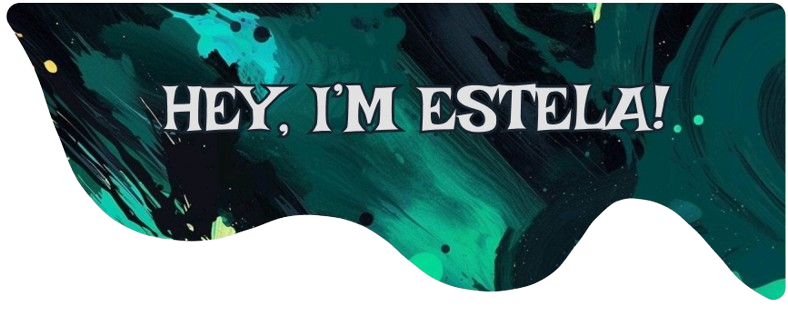
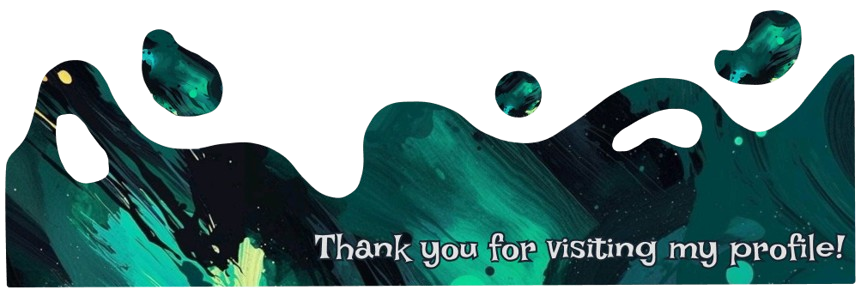

|  |
|:----------------------------------------------------------------------:|

## Sobre mí
- 💻 Técnica Superior en Desarrollo de Aplicaciones Multiplataforma.
- 🏅 Mención honorífica en el Proyecto Final del ciclo ([CubeX](https://github.com/estelaV9/TFG_CubeX)).
- 🤝 ¡Abierta a todo tipo de consejos! Siempre agradecida por la ayuda de la comunidad de GitHub.
- 👩‍💻 &lt;coding in&gt; progress.

## Lenguajes y herramientas

    <code></code>
    <code></code>
    <code></code>
    <code></code>
    <code></code>
    <code></code>
    <code></code>
    <code></code>
    <code></code>
    <code></code>
    <code></code>
    <code></code>
    <code></code>
    <code></code>
    <code></code>
    <code></code>
    <code></code>
    <code></code>
    <code></code>

 
  
<h2>📜 Licencias y certificaciones</h2>

  <table>
    <tr>
      <td>
        <h3 align="center">Introducción a Spring Data JPA</h3>
      </td>
      <td width="25%">
        <h3 align="center">HHSS + Iniciación a Java</h3>
      </td>
      <td width="25%">
        <h3 align="center">Java</h3>
      </td>
    </tr>
    <tr>
      <td align="left" width="40%">
        
        

          Realizado un curso de <b>Introducción a Spring Data JPA</b> en OpenWebinars.  
          <a href="https://github.com/estelaV9/AccesoADatos/blob/master/Curso_IntroduccionSpringDataJPA/certificado_introducci%C3%B3n_a_spring_data_jpa.pdf">Ver certificado</a>
        

      </td>
      <td colspan="2" width="60%">
        

         Durante las prácticas del ciclo DAM, recibí una formación intensiva de 1 mes dividida en dos partes:
          <ul>
            <li><strong>Habilidades blandas:</strong> empleabilidad, comunicación, trabajo en equipo, creación de CV y entrevistas.</li>
            <li><strong>Java (JSE + JEE):</strong> fundamentos, POO, herencia, Spring MVC, Hibernate, pruebas unitarias y APIs REST con Spring Boot.</li>
          </ul>
          Finalizamos con un <strong>proyecto práctico en Spring MVC</strong> para aplicar los conocimientos adquiridos.
        

      </td>
    </tr>
  </table>

 
  
<h2>📘 Proyectos actuales</h2>

    <h3>CubeX: Aplicación multiplataforma para speedcubing</h3>
  
  
         
CubeX es una aplicación multiplataforma desarrollada inicialmente como Trabajo de Fin de Grado (TFG), centrada en el mundo del <i>speedcubing</i>, la práctica de resolver cubos Rubik o rompecabezas en el menor tiempo posible. Diseñada para cubrir tanto las necesidades de usuarios principiantes como avanzados, CubeX ofrece una experiencia completa, intuitiva y accesible que va más allá de un simple temporizador. 

<h4>🛠 Tecnologías utilizadas</h4>
<ul>
  <li>
    <h5> Flutter +  Dart</h5>
    

      Desarrollo con una única base de código multiplataforma para Android y Windows, garantizando una experiencia accesible e internacionalizada. Pronto estará disponible tanto para macOS y iOS como para Linux.
    

  </li>
  <li>
    <h5> Supabase</h5>
    

      Backend como servicio que ofrece:
      <ul>
        <li>Autenticación segura de usuarios.</li> 
        <li>Base de datos en tiempo real (PostgreSQL).</li> 
        <li>Almacenamiento en la nube para datos e imágenes.</li>
      </ul>
    

  </li>
  <li>
    
    <h5> Figma</h5>
    

      Usado para el diseño UI/UX y prototipado de toda la aplicación, con una interfaz atractiva, accesible y fácil de usar. Además, la app cuenta con una mascota propia llamada Cubix, que guía al usuario durante su experiencia en la aplicación, sobretodo inicialmente.
    

  </li>
</ul>

 

<h4>Funcionalidades</h4>
Entre sus funcionalidades más destacadas se encuentran:
<ul>
  <li>Un <b>temporizador</b>, con opciones avanzadas de configuración y personalización completa de sonidos, inspección previa e idiomas.</li>
  <li>Un <b>generador de scrambles</b> adaptado a múltiples tipos de cubo (2x2, 3x3, Square-1, Megaminx, Pyraminx, etc.)</li>
  <li>Un sistema de <b>estadísticas detalladas</b>, que permite al usuario consultar sus mejores tiempos, promedios como Ao5, Ao12, Ao100, 
  porcentaje de penalizaciones y visualizar gráficas de rendimiento con los tiempos de cada sesión.</li>
  <li><b>Exportación de tiempos en PDF</b>, útil para compartir progresos o mantener un registro físico o digital de los tiempos de cada sesión.</li>
  <li>Integración de <b>notificaciones y recordatorios</b>, para mantener la constancia en el entrenamiento.</li>
</ul>

 

<h4>Características adicionales</h4>

🏅 CubeX fue reconocida como el mejor proyecto del curso, otorgándole la <b>Mención Honorífica</b> al proyecto. Como parte de la presentación, se complementó con: 

<ul>
  <li>Folletos informativos para los que asistieron a la presentación.</li>
  <li>Pegatinas de la mascota de la aplicación, Cubix.</li>
  <li> Camiseta personalizada con Cubix.</li>
</ul>

 

<h4>Actualidad</h4>

Actualmente, CubeX ha evolucionado como un proyecto independiente del entorno académico. Se continúa trabajando activamente en su desarrollo con nuevas funcionalidades como:

<ul>
  <li>Modo <b>versus</b> para competir con otros usuarios.</li>
  <li><b>Chat</b> para interacción social entre la comunidad.</li>
  <li>Sistema ampliado de <b>scrambles</b> y análisis con <b>IA</b></li>
</ul>

© Además, se está investigando su <b>protección legal mediante patente</b> y analizando estrategias para su futura distribución en tiendas de aplicaciones.

 
  
<h2>📚 Módulos cursados</h2>

  <table>
    <tr>
      <td>
        

          
           
          
        

      </td>
      <td>
        

          
           
          
        

      </td>
      <td>
        

          
           
          
        

      </td>
    </tr>
    <tr>
      <td>
        

          
           
          
        

      </td>
      <td>
        

          
           
          
        

      </td>
      <td>
        

          
        

      </td>
    </tr>
  </table>

&nbsp;

 
  
<h2>🌠 Proyectos tops</h2>

  <table>
    <tr>
      <th width="50%">
        <h3 align="center">TFG CubeX</h3>
      </th>
      <th width="50%">
        <h3 align="center">$BankPal Wireframe</h3>
      </th>
    </tr>
    <tr>
      <td> 
        

          
        

          <a href="https://github.com/estelaV9/TFG_CubeX"><b>CubeX</b></a> fue mi Trabajo Fin de Grado, una app multiplataforma enfocada en el <i>speedcubing</i>, desarrollada con Flutter y Supabase.  
          En el módulo de <a href="https://github.com/estelaV9/DesarrolloInterfaces">Desarrollo de Interfaces</a> diseñé e implementé el temporizador, historial, pantalla de ajustes (con idioma), registro de usuario y sección "About". 
          <ul align="left">
                  <li>
                      <a href="https://github.com/estelaV9/DesarrolloInterfaces/blob/master/ProyectoFlutter_ParteTFG/EnunciadoPractica.md">Enunciado</a> del proyecto. 
                  </li>
                  <li>
                          <a href="https://github.com/estelaV9/DesarrolloInterfaces/blob/master/ProyectoFlutter_ParteTFG/EstelaDeVega_WireframeCubeX.pdf">Esquema</a> (mockup o wireframe) de cómo estará diseñada la aplicación y una descripción de ella.   Nota: 10.                     
                  </li>
                <li>
                  <a href="https://github.com/estelaV9/DesarrolloInterfaces/blob/master/ProyectoFlutter_ParteTFG/EstelaDeVega_ModeloInicialCubeX.pdf">Modelo incial</a> de la aplicación.  
                  Incluye los casos de uso, los diagramas de componentes de las pantallas, el UML y la <a href="https://github.com/estelaV9/DesarrolloInterfaces/blob/master/ProyectoFlutter_ParteTFG/databaseCubeX.db">base de datos</a>.   Nota: 10. 
                </li>
          </ul>
          🏅 Nota final del TFG: <b>10 + Mención Honorífica</b> | Nota proyecto del módulo: <b>8.5</b>  
          
           
           
        

        
 
      </td>
      <td>
        

          
           
          
Ampliación de la idea de proyecto de <a href="https://github.com/estelaV9/PMDM/tree/master/introduccion">$BankPal</a> del módulo de PMDM a <b>Figma</b> en el módulo de Desarrollo de Interfaces, se desarrolló una <a href="https://www.figma.com/design/PizvLATau8znIQ6XHmyI3y/Untitled?node-id=0-1&t=88QiglBwpE1F3hZd-1">aplicación</a> de banco más completa y con más funcionalidades.  
            Enunciado y <a href="https://github.com/estelaV9/DesarrolloInterfaces/blob/master/Tema1_Dise%C3%B1oInterfacesGraficas/Ejercicios/EjercicioFigma_BankPal/PracticaFigma.md">manual de usuario</a>.    
            Nota: 10.        
          

        
 
      </td>
    </tr>
    <tr>
      <th width="50%">
        <h3 align="center">CubeX</h3>
      </th>
      <th width="50%">
        <h3 align="center">Shruk's Museum</h3>
      </th>
    </tr>
    <tr>
    <td>
        

          
           
          
Acabada una aplicación de cubos de Rubik, donde podrás cronometrar tus tiempos, participar en competiciones, consultar tus estadísticas y competir en enfrentamientos uno contra uno.
          Con referencia al proyecto de <a href="https://github.com/estelaV9/CubexDatabase">base de datos</a>.  Nota final: 9.5  
                    
          

        
 
      </td>
      <td>
        

          
          
Museo peculiar sobre Shruk, un alter ego oscuro de Shrek. Explora una colección única de imágenes relacionadas con este personaje peculiar. 🐸 Nota de programación : 7.80   Nota entornos : 10.   Nota final: 8.45

        

      </td>
    </tr>                                                           
  </table>

&nbsp;

 
  
<h2>📊 Estadísticas GitHub</h2>

  

    <a href="https://github.com/estelaV9">
      
      
      
      <!--  -->
      <!--   -->
    </a>
  

