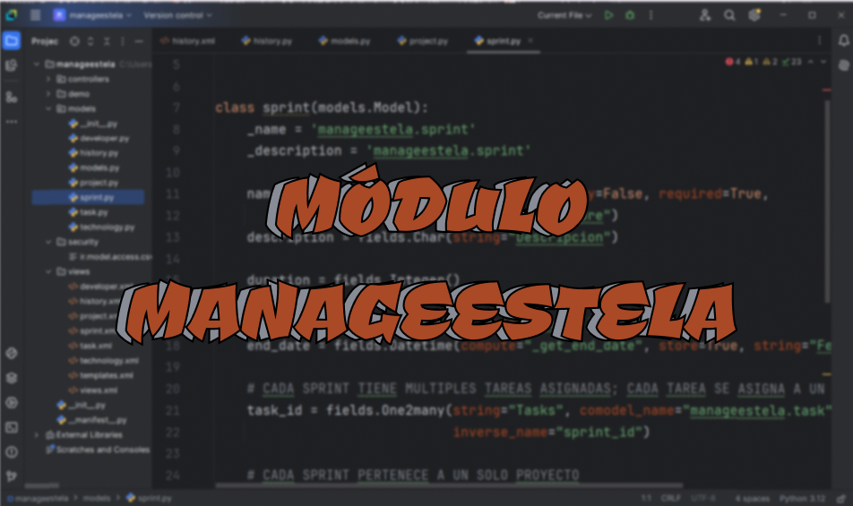

  <h1 align="center">Hola, soy Estela! 👋</h1>

## Sobre mí
- 💻 Estudiante de Desarrollo Aplicaciones Multiplataforma.
- 🤝 ¡Abierta a todo tipo de consejos! Siempre agradecida por la ayuda de la comunidad de GitHub.
- 👩‍💻 &lt;coding in&gt; progress.

## Lenguajes y herramientas

    
    
      
    
    
    
    
    
    
    
    
    
    
    
    
    
    
    
    

## Proyectos *actuales*
<table>
  <tr>
    <th width="25%">
      <h3 align="center">CubeX TFG</h3>
    </th>
    <th width="25%">
      <h3 align="center">Módulo Manageestela de Odoo</h3>
    </th>
    <th width="25%">
      <h3 align="center">Gestión de Partes</h3>
    </th>
    <th width="25%">
      <h3 align="center">Casa de los Fantasmas</h3>
    </th>
  </tr>
  <tr>
    <td width="25%">
      

        
        
Empezando una parte del <a href="https://github.com/estelaV9/TFG_CubeX">TFG</a> en el módulo de Desarrollo de Interfaces de <b>CubeX</b>.   
          Una aplicación que, por ahora, será un timer para las resoluciones de los diferentes cubos de Rubik y dispondrá de un historial y estadísticas.
            <ul>
                <li>
                    <a href="https://github.com/estelaV9/DesarrolloInterfaces/blob/master/ProyectoFlutter_ParteTFG/EnunciadoPractica.md">Enunciado</a> del proyecto.
                </li>
                <li>
                    

                        <a href="https://github.com/estelaV9/DesarrolloInterfaces/blob/master/ProyectoFlutter_ParteTFG/EstelaDeVega_WireframeCubeX.pdf">Esquema</a> (mockup o wireframe) de cómo estará diseñada la aplicación y una descripción de ella.
                    

                </li>
            </ul>
      
 
    </td>
    <td width="25%">
      

        
        
Realizando una memoria del desarrollo del módulo Manageestela para Odoo, detallando:
          <ul>
            <li>Los fundamentos de ERP y SCRUM.</li>
            <li>La arquitectura y diseño del módulo.</li>
            <li>Su ampliación.</li>
            <li>Las herramientas utilizadas.</li>
            <li>Las pruebas realizadas.</li>
          </ul>

      

    </td>
    <td width="25%">
      

        
        
Realizando un <a href="https://github.com/HugoReyHol/gestion-faltas">proyecto</a> final en Hibernate en grupo implementando un sistema con dos tipos de 
          <ul>
            <li>Usuaurios.</li>
            <li>Profesores.</li>
            <li>Jefes de Estudios.</li>
          </ul>
          Cada uno con menús específicos para gestionar partes, alumnos y profesores.

      
 
    </td>
    <td width="25%">
      

        
        
Desarrollando una <a href="https://github.com/estelaV9/ProyectoCasaFantasmas">aplicación</a> de <b>"La Casa de los Fantasmas"</b>, donde se tendrá que navegar por la mansión resolviendo enigmas en cada habitación para moverte hasta alcanzar la habitación final con los dulces.

      

    </td>
 </tr>  
</table>  

## Proyectos actuales *anteriores*
<table>
  <tr>
    <th width="50%">
      <h3 align="center">$BankPal Application</h3>
    </th>
    <th width="50%">
      <h3 align="center">CubeX Galaxy Shopping App</h3>
    </th>
  </tr>
  <tr>
    <td width="50%">
      

        
        
Práctica de repaso PMDM para gestionar cuentas bancarias de los clientes.  
            Nota: La tarea esta perfecta   
            Se ha ampliando la idea de proyecto en el módulo de <b>Desarrollo de Interfaces</b> en Figma,
            desarrollando una <a href="https://www.figma.com/design/PizvLATau8znIQ6XHmyI3y/Untitled?node-id=0-1&t=88QiglBwpE1F3hZd-1">aplicación</a> de banco más completa y con más funcionalidades  
            Nota: 10.

      
 
    </td>
    <td width="50%">
      

        
        
Ejercicio formulario AAD para la compra de cubos de Rubik con su <a href="https://github.com/estelaV9/AccesoADatos/blob/master/Tema1_AccesoBDRelacionales/EjercicioFormularioFX/PracticaFormulario.md">manual de usuario</a> de la práctica.   
          ESTADO: TERMINADO   
          Se está realizando esta misma idea en el módulo de <b>Sistemas de Gestión Empresarial</b> pero en el Lenguaje de Programación <b>Python</b>. 
          Puedes consultar el ejercicio en la <a href="https://github.com/estelaV9/SistemasGestionEmpresarial/tree/master/Tema3_Python/Python_SGE/12proyecto_cubex">Práctica 12</a>.  
          Nota: 9.20.

      
 
    </td>
 </tr>                                                           
</table>  
&nbsp;

## Módulos *cursando*
<table>
  <tr>
    <th width="33%">
      <h3 align="center">Acceso a Datos</h3>
    </th>
    <th width="33%">
      <h3 align="center">PMDM</h3>
    </th>
    <th width="33%">
      <h3 align="center">Sistema de Gestión Empresarial</h3>
    </th>
  </tr>
  <tr>
    <td width="33%">
      

        
        
Ejercicios del módulo de Acceso a datos.  
                  
        

      
 
    </td>
    <td width="33%">
      

        
        
Ejercicios del módulo de PMDM.  
          
        

      
 
    </td>
    <td width="33%">
      

          
        
Ejercicios del módulo de SGE

      
 
    </td>
  </tr>
  <tr>
    <th width="33%">
      <h3 align="center">Desarrollo de Interfaces</h3>
    </th>
    <th width="33%">
      <h3 align="center">Programación de Servicios y Procesos</h3>
    </th>
    <th width="33%">
      <h3 align="center">Empresa e Iniciativa Emprendedora</h3>
    </th>
  </tr>
  <tr>
    <td width="33%">
      

          
         
        
Ejercicios del módulo de Desarrollo de Interfaces.

      
 
    </td>
    <td width="33%">
      

        
        
Ejercicios del módulo de Programación de Servicios y Procesos.

      
 
    </td>
    <td width="33%">
      

        
        
Ejercicios del módulo de Empresa e Iniciativa Emprendedora.

      
 
    </td>
  </tr>
</table>  
&nbsp;

## Proyectos *tops*
<table>
  <tr>
    <th width="50%">
      <h3 align="center">Shruk's Museum</h3>
    </th>
    <th width="50%">
      <h3 align="center">CubeX</h3>
    </th>
  </tr>
  <tr>
    <td>
      

        
        
Museo peculiar sobre Shruk, un alter ego oscuro de Shrek. Explora una colección única de imágenes relacionadas con este personaje peculiar. 🐸 Nota de programación : 7.80   Nota entornos : 10.   Nota final: 8.45

      

    </td>
    <td 
      

        
        
Acabada una aplicación de cubos de Rubik, donde podrás cronometrar tus tiempos, participar en competiciones, consultar tus estadísticas y competir en enfrentamientos uno contra uno.
        Con referencia al proyecto de <a href="https://github.com/estelaV9/CubexDatabase">base de datos</a>.  Nota final: 9.5  
                  
        

      
 
    </td>
  </tr>                                                           
</table>  
&nbsp;

## ⚙️ Estadísticas GitHub 

  

